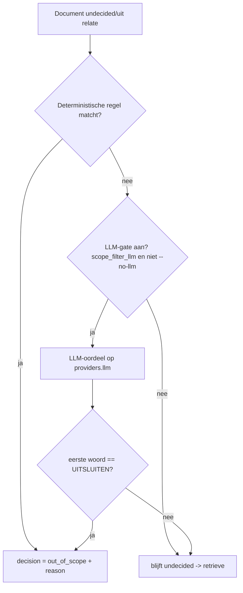

# Pijplijnstap: scope-filter

> Sjabloon-proof. Elke claim is onderbouwd met een code-verwijzing of een run-artefact.

## Doel

De scope-filter markeert documenten die met zekerheid buiten de zoekvraag vallen, vóór de dure
retrieval/ranking. Het ontwerp is **recall vóór precisie**: deterministische, goedkope regels
sluiten eerst evident procesmateriaal uit; alleen wat geen regel beslist gaat (optioneel) naar een
LLM-gate, en die sluit alléén uit bij zekerheid — bij twijfel blijft een document `undecided` en
stroomt door (`src/zeef/pipeline/scope_filter.py:5-8`, systeemprompt `:20-25`). De precisie-verfijning
gebeurt later in de relevantiescoring, niet hier.

## Input

`list[Document]` — komt uit de **relate**-stap (`src/zeef/pipeline/run.py:124-127`). Documenten kunnen
al een `decision` dragen van de eerdere **validity**-stap (`run.py:121`); de scope-filter respecteert
een bestaande `out_of_scope`-markering en herhaalt die (`scope_filter.py:68-69`).

## Output

Dezelfde `list[Document]`, nu met per document `decision` ∈ {`out_of_scope`, `undecided`} en een
`decision_reason` + audit-event (`scope_filter.py:52-64`). Alleen `undecided`-documenten gaan naar de
**retrieve**-stap (`run.py:128`); op het EVAL-corpus bereikten zo 145 van 1006 docs retrieve
(audit `scope-complete`: `undecided: 145`).

## Beslissing

Twee lagen, in volgorde:

1. **Deterministische regels** (`scope_filter.py:_apply_rules :67-74`), geordende set in
   `src/zeef/pipeline/scope_rules.py:82-87`:
   - `forwarded-only` — doorgestuurd bericht zonder eigen inhoud (`scope_rules.py:29-38`)
   - `calendar-invite` — agenda-uitnodiging (`:41-52`)
   - `process-notification` — no-reply / automatisch bericht (`:55-62`)
   - `thread-tail` — eerdere mail, vertegenwoordigd door de thread-tip (`:65-71`)

   Alle vier zijn **e-mail-only** (`if doc.doc_type != "email": return None`) en puur, dus
   deterministisch en herhaalbaar. Er is bewust **géén** `rule_duplicate` meer: inhoud-duplicaten
   mogen niet vóór de ranking worden uitgesloten (recall-gate), ze collapsen ná de ranking in
   `select` (`scope_rules.py:74-78`, converge-ranking-invariant D20.5).

2. **Optionele LLM-gate** op het residu (docs die geen regel besliste), alleen als er een
   LLM-provider is en niet onder `--no-llm` (`scope_filter.py:_llm_fallback :77-99`). De gate is
   recall-veilig: een document wordt **alléén** uitgesloten als het eerste woord van het
   LLM-antwoord `uitsluiten` is, anders behouden (`scope_filter.py:_is_exclude_verdict :38-41`).

## Parameters / knoppen

| Knop | Default | Effect | Bron |
|---|---|---|---|
| `ZEEF_SCOPE_FILTER_LLM` | `true` | `false` → regels-only, residu blijft `undecided` | `config.py:65` → `profiles.py:41` → `scope_filter.py:80` |
| `--no-llm` (CLI) | uit | schakelt álle generatieve stappen uit, inclusief deze gate | `scope_filter.py:80` |
| `ZEEF_OLLAMA_LLM_MODEL` | `qwen3` | wélk model de gate gebruikt (de gate draait op `providers.llm`) | `config.py:39`, `scope_filter.py:87` |

De gate gebruikt geen apart model: het is dezelfde LLM als de rest van de run
(`scope_filter.py:87` `llm = providers.llm`).

## Lokaal / hybride / cloud

- **Regels**: altijd lokaal-deterministisch, geen netwerk of gewichten. Werken in elk profiel.
- **LLM-gate**: volgt het profiel via `providers.llm` — sovereign → lokaal Ollama-model, cloud →
  Claude (`profiles.py` `_resolve_llm`). 
- **Afweging**: regels-only = volledig air-gapped, snel, maar grof (alleen e-mail-heuristiek; op een
  PDF-corpus vuurt geen enkele regel — zie hieronder). De LLM-gate voegt semantisch scope-oordeel toe,
  maar de kwaliteit hangt **volledig** aan het model: een te klein model is destructief (zie
  valkuilen). Voor een PDF-dossier zonder e-mailheaders voegen de regels niets toe en is de gate de
  enige scope-laag.

## Stap-flow

## Bekende valkuilen & bevindingen

### 1. Scope-filter-collapse met een te klein gate-model — STATUS: ACTIEF recall-risico

Met de LLM-gate aan op een klein model (`qwen3:0.6b`) sluit de gate bijna alles uit. Bewijs uit
`runs/converge-blind-20260625-201522/audit.jsonl`:
- `scope-filter` `llm-decision`-events: **349× UITSLUITEN, 4× BEHOUDEN** (349 van 353 beoordeelde docs).
- `scope-complete`: `excluded: 410, undecided: 4` op een corpus van 414 → slechts **4 docs** bereikten
  retrieve (`retrieve/first-pass` lengte 4; `score-complete scored: 4`).

Dat is ~99% uitsluiting; de trechter klapt dicht vóór de ranking. Het is geen
default-naar-uitsluiten-artefact (de gate is recall-veilig, `scope_filter.py:38-41`) maar
zelfverzekerd-foute oordelen van een te klein model.

**Mitigatie (gemeten):** gate uit (`ZEEF_SCOPE_FILTER_LLM=false` of `--no-llm`) → op een
~1000-doc-corpus bereikten dan 889 docs retrieve i.p.v. de collapse
(`runs/woo-C-cloud/audit.jsonl`: `scope_filter_llm: false`, `undecided: 889`). Alternatief: een
groter gate-model.

### 2. thread-tail recall-risico — STATUS: LATENT (niet-actief op PDF)

De `thread-tail`-regel sluit niet-tip-berichten uit in de aanname dat de thread-tip de inhoud draagt.
In de smalle conditie *RFC 5322-gethreade mail ÉN een quote-vrije/korte tip* collapst dit een
inhoudelijk eerder bericht naar een tip die de validity-gate vervolgens als `empty-after-ocr` laat
vallen → het hele thread verdwijnt pre-retrieve (gedocumenteerd in de docstring van
`rule_thread_tail`, `scope_rules.py`). Waargenomen op een synthetisch e-mailcorpus (recall-cap 0.61).

**Niet-actief op PDF-dossiers:** die missen e-mailheaders, dus de e-mail-only regel vuurt nooit.
Bevestigd: **0 thread-tail-vuringen** op het Woo-PDF-corpus (`runs/woo-C-cloud{,-v2}/audit.jsonl`:
111 scope-filter-exclusions, allemaal de oude dedup-regel, geen thread-tail). Geen fix nu; de
recall-safe variant is een toekomstige OpenSpec-change zodra écht gethreade e-mail een use-case wordt.
